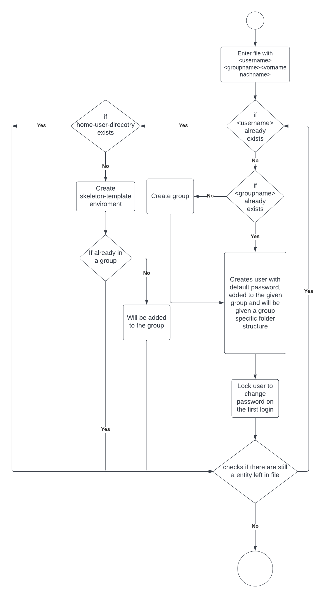
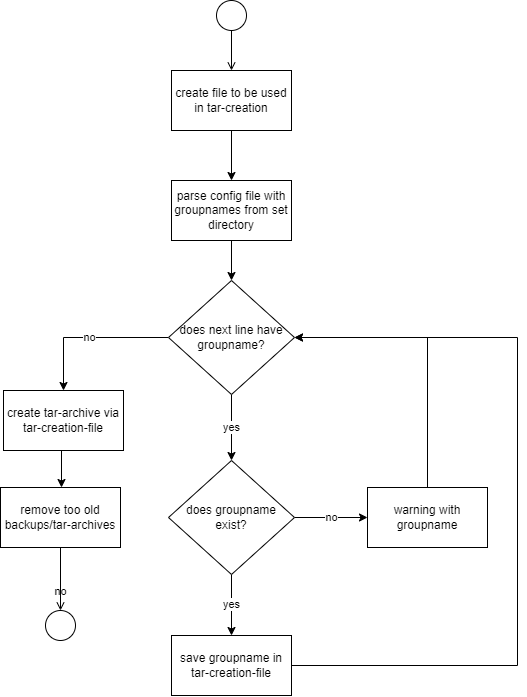

# Projekt Dokumentation

[[_TOC_]]

## Lösungsdesign
Anhand der Analyse wurde folgendes Lösungsdesign entworfen.

### Aufruf der Skripte

Skript 1: User create skript

        vagrant@vagrant:~$ ./usercreate.sh NAME_OF_FILE.txt

### Ablauf der Automation

Skript 1: User create skript

Skript 2: Backup create skript

### Konfigurationsdateien

TODO: Definieren sie welche Parameter in welchen Konfigurationsdateien gespeichert werden.
Skript 2: Im config-file sind pro Zeile Groupnames definiert, welche im Skript verwendet werden

## Abgrenzungen zum Lösungsdesign

TODO: Nachdem das Programm verwirklicht wurde, hier die Unterschiede von der Implementation zum Lösungsdesign beschreiben (was wurde anders gemacht, was wurde nicht gemacht, was wurde zusaetzlich gemacht)
